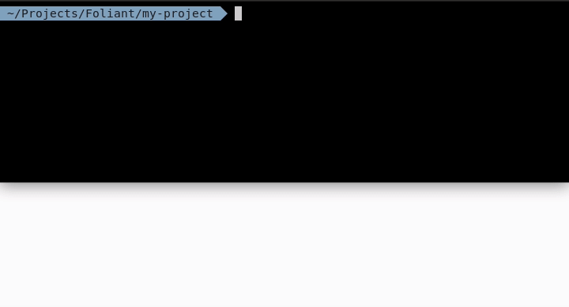

[](https://pypi.org/project/foliant/)
[](https://travis-ci.org/foliant-docs/foliant)
[](https://codecov.io/gh/foliant-docs/foliant)



# Foliant

Foliant is an all-in-one single-source documentation authoring tool. It lets you produce standalone documents in **pdf** and **docx**, build **static websites** and upload pages to **Confluence**, all from single Markdown source.

Foliant is a higher order tool, which means it uses other programs to do its job. For building pdf and docx, it can use [Pandoc](https://pandoc.org/) or [md-to-pdf](https://github.com/simonhaenisch/md-to-pdf), for websites [MkDocs](https://www.mkdocs.org/), [Aglio](https://github.com/danielgtaylor/aglio) or [Slate](https://github.com/slatedocs/slate).

Foliant preprocessors let you reuse parts of your documents, show and hide content with flags, render diagrams from text, and much more.

Foliant is highly extensible, so if it lacks some functions or output formats you can always make a plugin for it or request one from our team.

[Foliant Documentation](https://foliant-docs.github.io/docs/) website.

## Installation

Foliant is written in Python and requires Python 3.6.

To install Foliant, use pip:

```shell
$ pip install foliant
```

Backends, extensions, and preprocessors are installed with pip as well. For the Quickstart, you'll need the [MkDocs backend](https://github.com/foliant-docs/foliantcontrib.mkdocs) and [init CLI extension](https://github.com/foliant-docs/foliantcontrib.init):

```shell
$ pip install foliantcontrib.mkdocs foliantcontrib.init
```

To build pdf and docx, install the [Pandoc backend](https://github.com/foliant-docs/foliantcontrib.pandoc):

```shell
$ pip install foliantcontrib.pandoc
```


## Quickstart

1. Create a new project:

```shell
$ foliant init
Enter the project name: Hello Foliant
✓ Generating Foliant project
─────────────────────
Project "Hello Foliant" created in /path/to/hello-foliant
```

This command creates a basic Foliant project:

```
hello-foliant/
├── foliant.yml
└── src
    └── index.md

1 directory, 2 files
```

`foliant.yml` is the project config file, `src` is the directory that contains the project source files (initially, just one file `index.md`).

2. Build a website from the newly created project:

```shell
$ foliant make site -p hello-foliant/
✓ Parsing config
✓ Applying preprocessor mkdocs
✓ Making site with MkDocs
─────────────────────
Result: Hello_Foliant-0.1.0-2017-11-24.mkdocs
```

3. Run a local webserver in the site directory and see the site in your browser:

```shell
$ cd Hello_Foliant-0.1.0-2017-11-24.mkdocs
$ python -m http.server
Serving HTTP on 0.0.0.0 port 8000 (http://0.0.0.0:8000/) ...
```

4. Build a standalone pdf document from the project:

```shell
$ foliant make pdf -p hello-foliant/
✓ Parsing config
✓ Applying preprocessor mkdocs
✓ Making pdf with Pandoc
─────────────────────
Result: Hello_Foliant-0.1.0-2017-11-24.pdf
```

> **Important**
>
> To produce pdf, Pandoc first converts Markdown to tex and then coverts it to pdf. To convert pdf > from tex, you need to have a LaTeX distribution installed:
>
> -   [MacTeX](http://tug.org/mactex/) for macOS
> -   [MikTeX](https://miktex.org/) for Windows
> -   [TeXLive](https://tug.org/texlive/) for Linux
