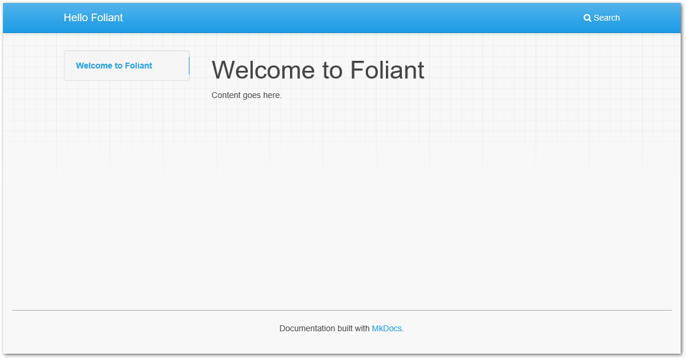

# Quickstart

In this tutorial, you'll learn how to use Foliant to build websites and pdf documents from a single Markdown source. You'll also learn how to use Foliant preprocessors.


## Create New Project

All Foliant projects must adhere to a certain structure. Luckily, you don't have to memorize it thanks to [Init](<macro pandoc="#foliantcontrib-init" mkdocs="cli/init.md">ref</macro>) extension.

You should have installed it during [Foliant installation](<macro pandoc="#installation" mkdocs="installation.md">ref</macro>) and it's included in Foliant's default Docker image.

```bash
$ foliant init
Enter the project name: Hello Foliant
✔ Generating Foliant project
─────────────────────
Project "Hello Foliant" created in path/to/hello-foliant
$ cd hello-foliant
$ tree
.
├── foliant.yml
└── src
    └── index.md

1 directory, 2 files
```

To do the same with Docker, run:

```bash
$ docker run --rm -it -v `pwd`:/usr/app/src -w /usr/app/src foliant/foliant init
Enter the project name: Hello Foliant
✔ Generating Foliant project
─────────────────────
Project "Hello Foliant" created in /usr/app/src/hello-foliant
```

Init command created a config file `foliant.yml` and a source directory `src` with one source file `index.md`. And that is the simplest Foliant project!


## Build Site

In the project directory, run:

```bash
$ foliant make site
✔ Parsing config
✔ Applying preprocessor mkdocs
✔ Making site with MkDocs
─────────────────────
Result: Hello_Foliant-2018-01-23.mkdocs
```

Or, with Docker Compose:

```bash
$ docker-compose run --rm hello-foliant make site
✔ Parsing config
✔ Applying preprocessor mkdocs
✔ Making site with MkDocs
─────────────────────
Result: Hello_Foliant-2018-01-23.mkdocs
```


That's it! Your static, MkDocs-powered website is ready. To serve it, use any web server. Since you must have Python installed, you can use its built-in server:

```bash
$ cd Hello_Foliant-2018-01-23.mkdocs
$ python -m http.server
Serving HTTP on 0.0.0.0 port 8000 (http://0.0.0.0:8000/) ...
```

Open [localhost:8000](http://localhost:8000) in your web browser. You should see something like this:




## Build PDF

In the project directory, run:

```bash
$ foliant make pdf
✔ Parsing config
✔ Applying preprocessor mkdocs
✔ Making site with MkDocs
─────────────────────
Result: Hello_Foliant-2018-01-23.pdf
```

That's it! Your static, MkDocs-powered website is ready. To serve it, use any web server. Since you must have Python installed, you can use its built-in server:

```bash
$ cd Hello_Foliant-2018-01-23.mkdocs
$ python -m http.server
Serving HTTP on 0.0.0.0 port 8000 (http://0.0.0.0:8000/) ...
```

Open [localhost:8000](http://localhost:8000) in your web browser. You should see something like this:


