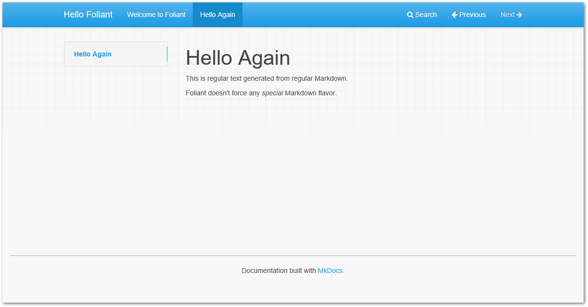
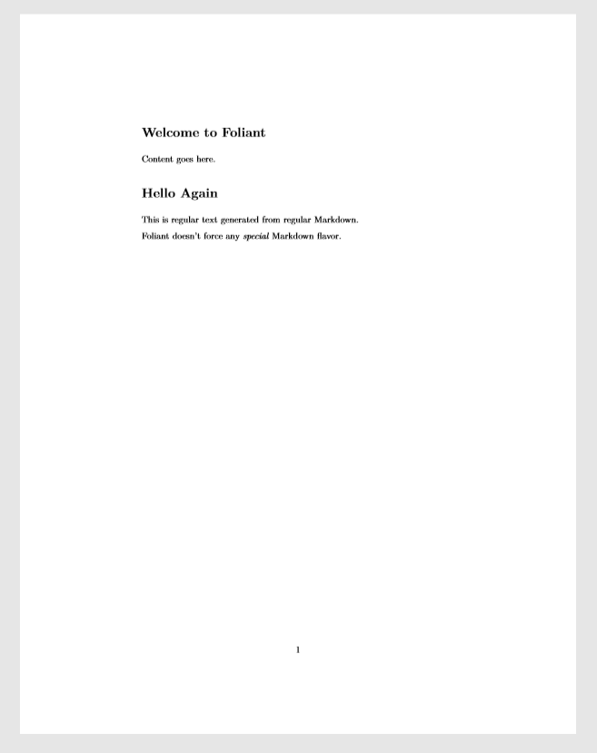

# Quickstart

In this tutorial, you'll learn how to use Foliant to build websites and pdf documents from a single Markdown source. You'll also learn how to use Foliant preprocessors.


## Create New Project

All Foliant projects must adhere to a certain structure. Luckily, you don't have to memorize it thanks to [Init](<macro pandoc="#foliantcontrib-init" mkdocs="cli/init.md">ref</macro>) extension.

You should have installed it during [Foliant installation](<macro pandoc="#installation" mkdocs="installation.md">ref</macro>) and it's included in Foliant's default Docker image.

```bash
$ foliant init
Enter the project name: Hello Foliant
✔ Generating Foliant project
─────────────────────
Project "Hello Foliant" created in hello-foliant
$ cd hello-foliant
$ tree
.
├── foliant.yml
└── src
    └── index.md

1 directory, 2 files
```

To do the same with Docker, run:

```bash
$ docker run --rm -it -v `pwd`:/usr/app/src -w /usr/app/src foliant/foliant init
Enter the project name: Hello Foliant
✔ Generating Foliant project
─────────────────────
Project "Hello Foliant" created in hello-foliant
```

Init command created a config file `foliant.yml` and a source directory `src` with one source file `index.md`. And that is the simplest Foliant project!


## Build Site

In the project directory, run:

```bash
$ foliant make site
✔ Parsing config
✔ Applying preprocessor mkdocs
✔ Making site with MkDocs
─────────────────────
Result: Hello_Foliant-2018-01-23.mkdocs
```

Or, with Docker Compose:

```bash
$ docker-compose run --rm hello-foliant make site
✔ Parsing config
✔ Applying preprocessor mkdocs
✔ Making site with MkDocs
─────────────────────
Result: Hello_Foliant-2018-01-23.mkdocs
```


That's it! Your static, MkDocs-powered website is ready. To view it, use any web server, for example, Python's built-in one:

```bash
$ cd Hello_Foliant-2018-01-23.mkdocs
$ python -m http.server
Serving HTTP on 0.0.0.0 port 8000 (http://0.0.0.0:8000/) ...
```

Open [localhost:8000](http://localhost:8000) in your web browser. You should see something like this:


## Build Pdf

>   **Note**
>
>   To build pdfs with Pandoc, make sure you have it and TeXLive installed (see [Installation](<macro pandoc="#installation" mkdocs="installation.md">ref</macro>)).

In the project directory, run:

```bash
$ foliant make pdf
✔ Parsing config
✔ Applying preprocessor flatten
✔ Making pdf with Pandoc
─────────────────────
Result: Hello_Foliant-2018-01-23.pdf
```

To build pdf in Docker container, first uncomment `foliant/foliant:pandoc` in your project's `Dockerfile`:

```diff
- FROM foliant/foliant
+ # FROM foliant/foliant
# If you plan to bake PDFs, uncomment this line and comment the line above:
- # FROM foliant/foliant:pandoc
+ FROM foliant/foliant:pandoc

COPY requirements.txt .

RUN pip3 install -r requirements.txt
```

>   **Note**
>
>   Run `docker-compose build` to rebuild the image from the new base image if you have previously run `docker-compose run` with the old one.

Then, run this command in the project directory:

```bash
$ docker-compose run --rm hello-foliant make pdf
✔ Parsing config
✔ Applying preprocessor flatten
✔ Making pdf with Pandoc
─────────────────────
Result: Hello_Foliant-2018-01-23.pdf
```

Your standalone pdf documentation is ready! It should look something like this:


## Edit Content

Your project's content lives in `*.md` files in `src` folder. You can split it between multiple files and subfolders.

Foliant encourages [pure Markdown](https://daringfireball.net/projects/markdown/) syntax as described by John Gruber. Pandoc, MkDocs, and other backend-specific additions are allowed, but we strongly recommend to put them in [`<<if></if>` blocks](<macro mkdocs="preprocessors/flags.md" pandoc="#flags">ref</macro>).

Create a file `hello.md` in `src` with the following content:

```markdown
# Hello Again

This is regular text generated from regular Markdown.

Foliant doesn't force any *special* Markdown flavor.
```

Open `foliant.yml` and add `hello.md` to `chapters`:

```diff
title: Hello Foliant

chapters:
  - index.md
+ - hello.md
```

Rebuild the project to see the new page:

```bash
$ docker-compose run --rm hello-foliant make site && docker-compose run --rm hello-foliant make pdf
✔ Parsing config
✔ Applying preprocessor mkdocs
✔ Making site with MkDocs
─────────────────────
Result: Hello_Foliant-2018-02-08.mkdocs
✔ Parsing config
✔ Applying preprocessor flatten
✔ Making pdf with Pandoc
─────────────────────
Result: Hello_Foliant-2018-02-08.pdf
```

And see the new page appear on the site and in the pdf document:






## Use Preprocessors

TODO
